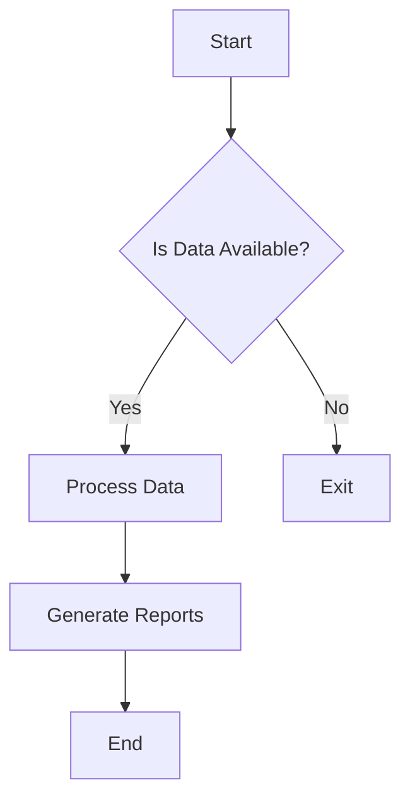

# Crew AI Stock Analysis

## Overview
This project is focused on analyzing stock data for insights and actionable information using AI techniques.

## Installation
To install the necessary packages, run:
```bash
pip install -r requirements.txt
```

## Usage
To run the analysis, use the following command:
```bash
python main.py
```

## Mermaid Diagram
Here’s a fixed flowchart diagram for a better representation:


## Conclusion
This README provides a concise guide on how to get started with the Crew AI Stock Analysis project, including installation instructions, usage, and a clear flowchart representation of the workflow.